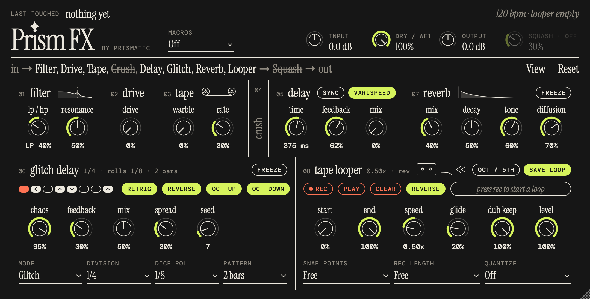
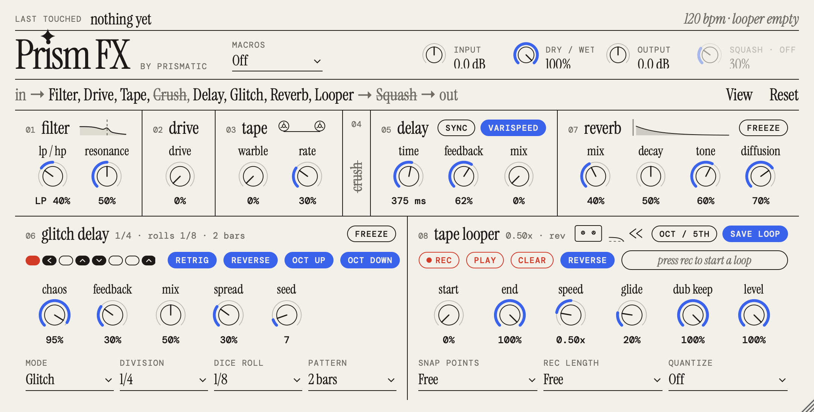

# Prism FX, by Prismatic





An AU / VST3 effect plug-in built from the CHOMPI firmware's effects and tape
looper. It's free and open source (AGPLv3). Prism FX is an independent project,
not made or endorsed by CHOMPI Club or Chase Bliss. Every control is a knob or button: the hardware's shift functions and
one-knob macros are split out into separate controls.

## Download and install (macOS)

Download `Prism-FX-<version>-macOS.zip` from the releases page, unzip it, and
follow `INSTALL.txt`:
1. Copy `Prism FX.component` to `~/Library/Audio/Plug-Ins/Components/` and
   `Prism FX.vst3` to `~/Library/Audio/Plug-Ins/VST3/`.
2. The plug-ins aren't notarized, so macOS may block them the first time. Run
   this in Terminal to allow them:
   ```bash
   xattr -dr com.apple.quarantine ~/Library/Audio/Plug-Ins/Components/"Prism FX.component" ~/Library/Audio/Plug-Ins/VST3/"Prism FX.vst3"
   ```
3. Restart your DAW (in Logic, rescan in the Plug-in Manager if it doesn't
   appear). Prism FX is listed under **Prismatic**.

It runs on Apple Silicon and Intel Macs.

To make the zip yourself, run `./Tools/package.sh`. It builds for both chips,
signs the plug-ins ad hoc, and writes `dist/Prism-FX-<version>-macOS.zip`.


| Section | Controls | Source |
|---|---|---|
| Filter | LP/HP (one knob: low-pass below noon, high-pass above), Resonance | TAPE `DJFilter.h` |
| Drive | Drive (soft clip with loudness compensation) | TAPE `DSPEngine.h` |
| Tape | Warble depth, Warble rate | TAPE `Warble.h` |
| Crush | Sample rate, Bits, Mix | new |
| Delay | Time (ms or synced division), Feedback, Mix, Varispeed | TAPE `DSPEngine.h` |
| Glitch Delay | see below | TEMPO `granularDelay.h` |
| Reverb | Mix, Decay, Tone, Diffusion, Freeze | TAPE/TEMPO `reverb.h` (Mutable Instruments) |
| Tape Looper | see below | TAPE `Sampler.h`, `LooperEngine.h` |
| Squash | Squash (output compressor/limiter) | TAPE `limiter.h` |

Each effect turns on and off by clicking its block in the chain strip, or its
title on its card. Switching crossfades so it never clicks. Input, Dry/Wet, Output and Squash sit in the panel at the top right.
Squash is the output compressor; turn it on with its block at the end of the
chain.

**Layout:** filter, drive, tape, crush, delay and reverb across the top row;
glitch delay and the tape looper side by side underneath. Switches that belong
to a whole effect (sync, varispeed, freeze) sit in its card's header. The
looper's header holds its transport (rec, play, clear, reverse), so the
waveform can take the full width below.

**Look:** indie editorial: one ink on a flat ground, hairline rules, Instrument
Serif with DM Mono caps, outlined pills.
- **View** (next to Reset) picks the **Night** or **Cream** theme and the size
  (75 to 150%). You can also drag the bottom-right corner to any size from
  75% to 200%. Both are saved with the project.
- **Pills:** toggles fill with the accent colour when on. Actions (rec, play,
  clear) have a red outline and fill red while pressed; rec stays red while
  recording.
- **The chain** reads as a sentence. Click a name to switch that effect on or
  off (off names are struck through), drag a name to reorder, and **Reset**
  restores the default order. Modules are numbered by their place in the chain.
- **Off effects fold** to a narrow strip with the name struck through. Click
  the strip to bring the effect back. The glitch delay is too big to fold: it
  stays in place, dimmed, with its title struck through, and its controls
  still work so you can set it up before switching it on.
- **Knobs:** the arc fills from the left, except on LP/HP, Input and Output,
  which have a real centre and fill out from noon. Double-click resets to default; shift- or cmd-drag for fine moves;
  the mouse wheel works too.
- **The status line** at the top shows the last control you touched (with a
  small bar for where it's set), and on the right the tempo and what the looper
  is doing. It only changes when something happens.
- **Header notes** spell out what's going on: the glitch delay's division, dice
  roll and pattern, and the looper's speed, direction and whether it's
  recording or overdubbing.
- **The glitch step lane** shows the pattern: filled steps will glitch, with a
  mark for what they'll do (||| retrigger, < reverse, ^ octave up, v octave
  down), and the playing step is red.
- Delay **Sync** turns the Time dial into note divisions of the host tempo.
- Delay **Varispeed** (on by default) treats the delay as a loop of tape whose
  speed is set by Time. Changing the time re-pitches what's already in the
  delay: at 100% feedback, going from 1/4 to 1/2 drops the loop an octave.
  Feedback can reach 100% in this mode and the loop holds. Turn it off for
  TAPE's original delay, which slides to the new time with a quick "whip".
- Each card has a hand-drawn sketch that follows its main controls and shows
  what the effect is doing. It only redraws when a setting changes.
  - Filter: the response curve.
  - Drive: the clean wave against the clipped one.
  - Tape: the reels and the warble.
  - Crush: the steps, set by rate, bits and mix.
  - Squash: peaks before and after.
  - Delay: echoes spaced by the time and fading with the feedback, bouncing
    left and right.
  - Reverb: the tail's length, density and tone, and freeze.
  - Looper: dub keep, as stacked overdub passes that fade as they get older
    (the newest turns red while recording or overdubbing).

### Signal flow

The default order is filter, drive, tape, crush, delay, glitch, reverb, looper,
then squash. To change it, drag the blocks in the strip under the header by
their grip. **Reset** puts the default order back. Squash always stays last, as the output
stage. The order is saved with the project.

Where the looper sits decides what gets recorded:
- **Looper last** (the default, like TAPE's default): the loop records the
  effected sound.
- **Looper first** (like TAPE's "FX after looper" setting): the loop records
  the dry sound, and the effects stay live on its playback.

### Glitch Delay

A stereo delay locked to the host tempo. On each "dice roll" (every 1/4 to
1/32 note), Chaos sets the chance that the next repeat becomes a variation:

- **Mode**: Glitch picks from retrigger, reverse, octave up and octave down.
  Shimmer always uses octave up.
- **Event switches**: Retrig / Reverse / Oct Up / Oct Down pick which
  variations Glitch mode can choose.
- **Spread**: how far each variation is panned at random.
- **Pattern** and **Seed** make the glitches repeatable. With a pattern length
  set, the rolls repeat every 1, 2 or 4 bars. Because they're counted from the
  song position, the same glitches land in the same places on every playback.
  Change the Seed for a different pattern.
- **Freeze**: captures the repeats and loops them in time.

### Tape Looper

The loop behaves like a tape loop:
- **Speed** changes pitch and tempo together. **Oct / 5th** turns the Speed
  dial into steps of octaves and fifths.
- **Stop** slows the tape to a halt, and **Play** spins it back up.
  **Reverse** runs the tape down through zero and back up the other way.
  **Glide** sets how long these speed changes take.
- **Overdubs** are written at the tape's current speed, so a part overdubbed at
  half speed plays back an octave up at normal speed.
- **Dub Keep** sets how much of the existing loop survives each overdub pass.
- **Scrub**: while stopped, click or drag the waveform to move the tape.
- **Position / Length** set which part of the tape loops. Playback and
  overdubs stay inside that window, and the audio outside it is kept.
  - Drag inside the window to slide it (the length stays put), or drag an edge
    or its tag to resize it. Double-click the window to go back to the whole
    tape.
  - The window **wraps**: slide it past the end of the tape and it carries on
    from the start, like a real tape loop.
  - Both are parameters, so a DAW LFO can move the loop around the tape.
  - The tags show where it is: bar.beat.sixteenth and a length in bars or beats
    when snapping, a percentage and seconds when free.
- **Snap** (1/16, 1/8, 1/4, 1 bar) snaps Position and Length to note values,
  counted from where the recording began, so the loop stays in time. Dotted
  lines inside the loop show the snap positions, and a ruler under the waveform
  counts bars and beats. Free lets them move anywhere.
- **Changes land at the end of a pass** by default: a new position or length
  waits until the current pass finishes, so every pass is whole and in time. A
  dashed outline marked "next pass" shows where it's going. Set "right away" in
  the Movement menu for instant jumps, which crossfade.
- **Wander** moves the window on its own, at the end of a pass:
  - The **Wander** knob sets how far. At 0% the loop stays put, and Movement
    reads Off.
  - **Movement** picks how: **drift** takes small random steps from where it is,
    **random** jumps anywhere within range ahead of the set position, and
    **scan** creeps forward a step each time. Wander sets the largest step
    (drift), the range (random, 100% = anywhere), or the step size (scan, 100% =
    a whole window).
  - **How often**: each pass, or every 1, 2 or 4 bars.
  - **New seed** picks a different path. The path starts over when the DAW
    starts playing, so the same seed takes the same path every playback.
  - With Snap on, every move lands on the snap grid.
  - Faint marks under the ruler show where the window was on the last few passes.

| Button | Does |
|---|---|
| REC | Empty: start recording. Recording: close the loop and keep overdubbing. Playing: overdub on/off. |
| PLAY | Recording: close the loop and play. Playing: stop. Stopped: play. |
| CLEAR | Erase the loop. |

- **Quantize** (Beat / Bar) holds a button press until the next beat or bar.
  The REC button blinks while a press is waiting.
- **Length** (1 to 8 bars) stops the first recording automatically at exactly
  that length, so the loop stays in time with the song.
- **Save Loop**: when the DAW saves the project, the loop's audio is stored in
  it (as 24-bit FLAC), so the loop is still there when you reopen it. Off saves
  only the settings. Clicking it changes nothing you can hear.
- **Drag Loop**: drag it onto an audio track in Ableton or Logic to drop in the
  part that's playing (the loop window, joined up if it wraps) as a 24-bit WAV. It's the audio
  as it sits on the tape, before speed and reverse. The files are kept in
  `~/Music/Prism FX/Loops`.
- **Length limit**: loops can be up to 2 minutes long.
- **MIDI mapping**: REC, PLAY and CLEAR are momentary parameters, so they can be
  MIDI-mapped in the DAW.

### Classic Macros

Classic Macros brings back the hardware's one-knob behaviour:
- Delay Feedback also sets the delay's dry/wet.
- Delay Time also sets the reverb decay.
- Reverb Mix also sets tone and diffusion.
- Warble sets both depth and rate.
- The glitch delay's panning and event choice follow TEMPO.

The controls this mode takes over are greyed out.

## Build (macOS)

You need CMake 3.22+ and Xcode or the Command Line Tools. JUCE is downloaded on
first configure.

```bash
cmake -B build -DCMAKE_BUILD_TYPE=Release
cmake --build build -j4
```

The AU and VST3 are copied to `~/Library/Audio/Plug-Ins/` after each build. To
turn that off, configure with `-DPRISM_INSTALL_PLUGINS=OFF`. A standalone app
is in `build/PrismFX_artefacts/Release/Standalone/`.

By default the build targets this Mac's chip only and skips link-time
optimisation, so rebuilds are quick. For a release build:

```bash
cmake -B build-release -DCMAKE_BUILD_TYPE=Release -DCMAKE_OSX_ARCHITECTURES="arm64;x86_64" -DPRISM_LTO=ON
```

To check the AU passes validation (Logic runs the same check):

```bash
auval -v aufx Pfx1 Prsm
```

### Dev tools

Configure with `-DPRISM_SNAPSHOT=ON` to build two dev tools:
- `PrismSnapshot` renders the editor to a PNG without a DAW. You can set
  parameters on the command line.
- `PrismStateTest` records a loop, saves the plug-in state, restores it into a
  new instance, and checks the loop and routing came back.

```bash
cmake -B build -DPRISM_SNAPSHOT=ON && cmake --build build --target PrismSnapshot PrismStateTest
./build/PrismSnapshot_artefacts/Release/PrismSnapshot ui.png glitch_on=1 reverb_mix=0.4
./build/PrismStateTest_artefacts/Release/PrismStateTest
```

## Porting notes

- The DSP in `Source/dsp/` is plain C++ with no JUCE or Daisy dependencies.
- The firmware runs at a fixed 48 kHz. Smoothing coefficients, delay lengths and
  filter coefficients are rescaled for the host rate (`RateScale` in `DspUtil.h`).
- The reverb's delay lengths are fixed at compile time, so at 88.2 kHz and above
  the reverb runs at half or quarter rate to keep its sound.
- The tape delay and reverb keep the firmware's 16-bit storage and clamping,
  which are part of their sound.

## Name

The plug-in name is set in one place: `PLUGIN_NAME` in `CMakeLists.txt`. The
AU/VST3 identity (manufacturer `Prsm`, plug-in `Pfx1`) is separate. Don't
change it after people have saved projects with the plug-in, or the DAW won't
find it in those projects.

## License

Prism FX is free software under the **GNU Affero General Public License v3**
(`LICENSE`). You can use, modify and share it, and even sell it. Anyone who
distributes it, or a modified version, has to make their full source available
under the same license, so improvements stay open.

- The effects are ported from the CHOMPI firmware, with DSP from Electrosmith's
  DaisySP and Mutable Instruments, all under the MIT license. Their notices are
  in `NOTICE.md`.
- JUCE is used under its AGPLv3 license.
- The fonts are under the SIL Open Font License (`Assets/fonts/`).
- The names "Prism FX" and "Prismatic" aren't covered by the code license. If you
  share a modified version, give it its own name (see `TRADEMARKS.md`).
